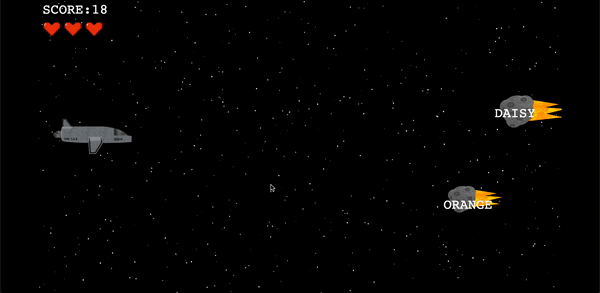

# Overview

TypeSpace is a typing game that was created from scratch by our team.  The game challenges typing abilities in a fun way by placing the player in outer space as a spaceship trying to manage the hostile environment of constant asteroids flying at the ship.  The player is given three lives and every time an asteroid crosses the left edge of the screen, a life is lost.  In order to shoot down an asteroid with the spaceship's lasers, the player must type out the target asteroid's word and press 'space' or 'enter' to destroy the asteroid before it reaches the ship.  Another thing to look out for is extra lives that fly across the screen.  These cannot cause you to lose a life, but if you type out life's attached word you can gain another life to help you survive the asteroids you have coming your way.

Use the link below to play the game right in your browser, no downloads required! Click to start, type the words that come across the screen, and put in the name you want for scorekeeping. Make sure you put in the same username every time if you want to keep trying for a better score! Simply refresh your page to try again.

[Play the game here](https://calesi19.github.io/TypeSpace/)

# Development Environment
This program was developed in Visual Studio Code primarily using Javascript, with the customary HTML and CSS.

# Collaborators
* Jake Soulier
* Carlos Lespin
* Xander Hunt
* Richard Nanney
* Nolan Jeppson

# Useful Websites
The following are resources used to create our web app:
* [How to take Keyboard Input in Javascript](https://stackoverflow.com/questions4416505how-to-take-keyboard-input-in-javascript)
* [Basic Introduction to Javascript](https://www.youtube.com/watch?v=W6NZfCO5SIk)
* [Keycodes for each Keyboard Key](https://www.toptal.com/developers/keycode)
* [Firestore Database Documentation](https://firebase.google.com/docs)
* [Basic Javascript Documentation](https://developer.mozilla.org/en-US/docs/Web/JavaScript)
* [Basic Javascript Canvas Documentation](https://developer.mozilla.org/en-US/docs/Web/API/Canvas_API/Tutorial)

# Future Work
* Reorganize and refactor code to be more efficient
* Boss fight
* Bigger list of words
* Proper end screen
* Transitions
